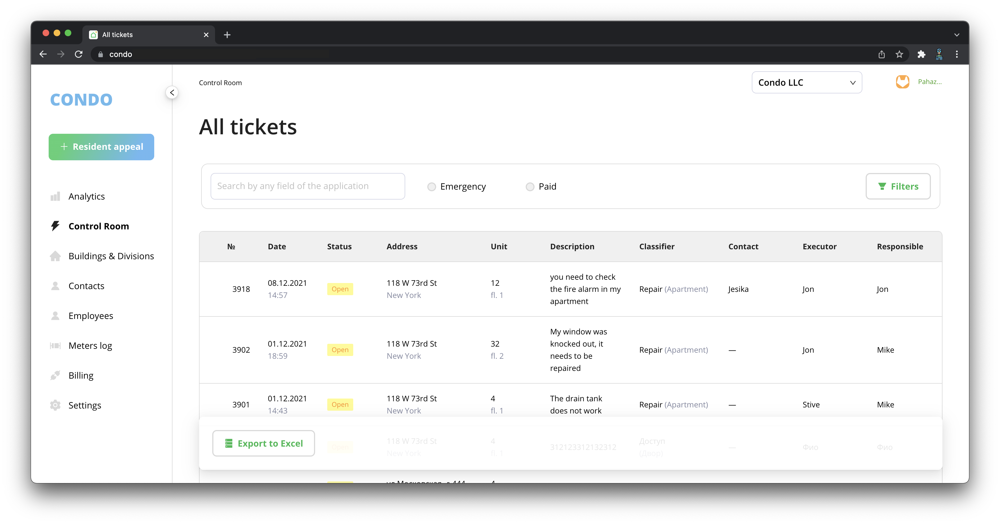

# CONDO

Open Source condominium management platform.



## Getting started

You should have `docker-compose`, `git`, `node` and `python3` commands.

> **Node should be > 16.** You can check node version using `node -v` command in your terminal.

```bash
# 1) Clone the repo
git clone git@github.com:open-condo-software/open-condo-platform.git condo
cd condo

# 2) Install dependencies and link workspaces
yarn
python3 -m pip install django
python3 -m pip install psycopg2-binary

# 3) startup redis and postgres
docker-compose up -d postgresdb redis

# 4) create base .env file
cp .env.example .env

# 5) prepare local packages
yarn build

# 6) create databases for all apps and apps/.env files
node ./bin/prepare.js

# 7) launch project
yarn workspace @app/condo start
```

Now open your browser and head to http://localhost:3000 - you should see condo app

Login and password can be found in `initialData.js`

## Developing

Check [developing.md](docs/develop.md)

## Deploying

Check [deploy.md](docs/deploy.md)

## Contributing

Check [contributing.md](docs/contributing.md)
