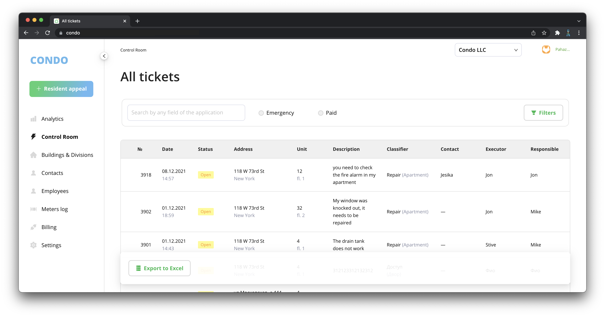

# CONDO

[Condo](https://github.com/open-condo-software/condo) is an Open Source property management SaaS 
that allows users to manage tickets, resident contacts, properties, 
payment tracking, create invoices, and oversee a service marketplace, 
all while offering an extension system for mini-apps, 
making it an ideal platform for property management companies and those servicing shared properties.



## Table of contents
- [Getting started](#getting-started)
    1. [Databases setup](#1-databases-setup)
    2. [Environment setup](#2-environment-setup)
    3. [Installing dependencies](#3-installing-dependencies)
    4. [Building `@open-condo` dependencies](#4-building-open-condo-dependencies) 
    5. [Preparing the local app environment](#5-preparing-the-local-app-environment)
    6. [Starting app in dev / prod mode](#6-start-app-locally-in-dev--prod-mode)
    7. [Starting the worker](#7-start-the-worker)
- [Developing](/docs/develop.md)
- [Contributing](/docs/contributing.md)
- [Migration guides](/docs/migration.md)
- [Deploying](/docs/deploy.md)

## Getting started

### 1. Databases setup

We use [Postgres 16.4](https://www.postgresql.org) to store most of the information, 
and [Redis 6.2](https://redis.io) to store session information, asynchronous tasks, and various caches. 
In addition to them, we use s3 to store files, but it is optional to get started.

You can start the databases using docker compose with this command:

```bash
docker compose up -d postgresdb redis
```

Or you can bring up the databases directly on the host machine, using the corresponding tutorials

### 2. Environment setup

#### Node.js 22.x

All of our applications are written in [Node.js](https://nodejs.org/en), 
so you should also install it before you run the project.

> We run our applications on the **current LTS** version of node, which is **22.x**. 
> You can check node version using `node -v` command in your terminal.

We recommend using [nvm](https://github.com/nvm-sh/nvm) for local development, 
and for deploying the application there is [Dockerfile](https://github.com/open-condo-software/condo/blob/main/Dockerfile)
ready to use at the root of the repository.

#### Python 3.x

We also use Python with packages for database migrations. So make sure you have one installed. 

### 3. Installing dependencies

To install Node.js dependencies simply type the following command:
```bash
yarn install
```

> If you get errors related to missing yarn, 
> use [these instructions](https://yarnpkg.com/getting-started/install) to install it.

> We also use [turborepo](https://turbo.build/repo/docs) to orchestrate npm modules in this monorepo. 
> Even though it is specified in the global `package.json`, in some environments you may get the error 
> `“turbo: command not found”` in further steps... 
> 
> In such cases, we recommend installing it globally using:
> ```bash
> npm i -g turbo@^2
> ```


To install python packages type the command:
```bash
pip install Django psycopg2-binary
```

### 4. Building `@open-condo` dependencies

Condo depends on several packages located in `./packages` directory, 
so it is required to build them before launching the main application. 
You can do it using this command:

```bash
yarn workspace @app/condo build:deps
```

### 5. Preparing the local app environment

We have a mechanism in place to get applications ready for launch, specifically:
1. Copy the global and local .env.example to .env
2. Create a database for each application and perform the necessary migrations in it
3. Assign dedicated ports to the applications
4. Run the local prepare of each application

> During the "local prepare" step each app prepares itself by filling extra environment variables, 
> creating test users and other entities, needed for the first launch.

To launch prepare script, run the following command:
```bash
node bin/prepare -f condo
```

> This step is only used in local development,
> so consider manually setting all environment variables
> and migrating databases using `yarn workspace @app/condo migrate` in real deployment pipelines.

### 6. Start app locally in dev / prod mode


#### Development mode

The application is now fully ready to be started. 
To start the application locally in development mode, simply run the following command:
```bash
yarn workspace @app/condo dev
```

#### Production mode

If, however, you want to build the app in production mode, then to do so, execute:
```bash
yarn workspace @app/condo build
```

And then run the project with:
```bash
yarn workspace @app/condo start
```

Now open your browser and navigate to http://localhost:4006, where you should see the app running 🥳. 

> You can control the port assigned by manually setting it in `apps/condo/.env` file. 
> Default one is assigned by prepare script during the prepare step
> (You can verify the `SERVER_URL` and `PORT` in the `apps/condo/.env` file)

To log in, go to http://localhost:4006/admin/signin and enter the following credentials:
- **Email:** `DEFAULT_TEST_ADMIN_IDENTITY`
- **Password:** `DEFAULT_TEST_ADMIN_SECRET`

These credentials can be found in the `app/condo/.env` file, which is generated by the `./bin/prepare.js` script.

### 7. Start the worker

Worker is a separate process that handles asynchronous tasks (such as sending notifications, importing, exporting and others)

To run it, you need to first build the application using:
```bash
yarn workspace @app/condo build
```

And then start it using:
```bash
yarn workspace @app/condo worker
```

## Major version migration guide

Check [migration.md](docs/migration.md)

## Developing

Check [developing.md](docs/develop.md)

## Contributing

Check [contributing.md](docs/contributing.md)

## Major versions migration guide

Check [migration.md](docs/migration.md)


## Deploying

Check [deploy.md](docs/deploy.md)
