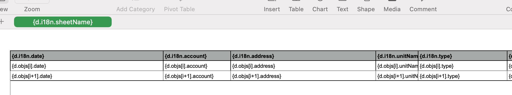

# Localization for open-condo-platform


## File structure

All files for localization are [stored in folders](https://github.com/open-condo-software/condo/tree/master/apps/condo/lang) distributed by locales `apps/condo/lang/[locale]/`
```
apps/condo/lang/
├─ [locale1]/
│  ├─ [locale1].json
│  └─ messages/
│     ├─ [messageType1]/
│     │  └─ *.njk
│     │  ...
│     └─ [messageTypeN]/
│        └─ *.njk
│  ...
└─ [localeN]/
```

Available transports are:
- email
- sms
- push

## Translation strings

Translation strings are stored within json files `apps/condo/lang/[locale]/[locale].json` in key-value manner.

## Message templates

`*.njk` files are [nunjucks](https://mozilla.github.io/nunjucks/templating.html) templates.

The name of template file is the name of transport. So, available file names are:
- `email.njk` or/and `email.html.njk`
- `sms.njk`
- `push.njk`
- `default.njk` will used in case there isn't any other template for chosen transport.

Each template file receives two variables:
1. `message` - the [Message](https://github.com/open-condo-software/condo/blob/master/apps/condo/domains/notification/schema/Message.js) model
2. `env` - the environment. For now contains an object with only one field `serverUrl`.

Example of `default.njk`:
```
Organization "{{ message.meta.organizationName }}" invited you as employee.
Click to the link to join: {{ env.serverUrl }}/auth/invite/{{ message.meta.inviteCode }}
```

This is nunjucks, so you are able to use any [filters](https://mozilla.github.io/nunjucks/templating.html#filters) you [want](https://mozilla.github.io/nunjucks/templating.html#builtin-filters).
But, there are no templates for dates formatting.
For this purpose we have own filter. Here is an example:
```
Ticket #{{ message.meta.ticketNumber }} dated {{ date | dateFormat('en') }} has been shared with you.
```

The `dateFormat` filter receives two arguments:
1. `locale` - string, e.g. `'en'` or `'ru'` or something else.
2. `format` - string, the date format for conversion to, default is `D MMMM YYYY`.
See [dayjs documentation](https://day.js.org/docs/en/parse/string-format#list-of-all-available-parsing-tokens) for custom format.

### Email messages

Each email message may be sent as plain text or as html document.

`email.njk` - is text template

`email.html.njk` - is html template

In case you create both templates, the message will be sent to email gateway including both formats. Which will be displayed is decision of user's email client.

Also, each email must contain the subject. Translations for email subjects stored in [json files](#translation-strings).

There is special format for string's codes:
```
notification.messages.<messageType>.<transportType>.<field>
```
For example:
```
{
  ...
  "notification.messages.INVITE_NEW_EMPLOYEE.email.subject": "...",
  ...
}
```
Each email subject receives `Message.meta` field for dynamic `{variable}`s:
```
{
  ...
  "notification.messages.TICKET_ASSIGNEE_CONNECTED.email.subject": "You were assigned as responsible of ticket #{data.ticketNumber}",
  ...
}
```

### Push messages
As emails have subjects, push messages have titles. Translations for push titles are stored in the same manner as email subjects.
For example:
```
{
  ...
  "notification.messages.TICKET_ASSIGNEE_CONNECTED.push.title": "You were assigned as responsible of ticket #{data.ticketNumber}",
  ...
}
```
Each push title receives the same `{variable}`s as email subjects.

## Excel templates

We use Excel files for exporting different tables data. Excel templates looks like:


### List name
Some excel templates has list names. Translations stored in [translation strings](#translation-strings).
Format is 
```
excelExport.sheetNames.<registry name>`
```
For example:
```
{
  ...
  "excelExport.sheetNames.buildings": "Buildings",
  "excelExport.sheetNames.tickets": "Tickets",
  ...
}
```

### Columns headers

Each exported table has column's headers which must be translated.
Translation for each header of each excel template stored in [translation strings](#translation-strings).
Translation codes has defined format:
```
excelExport.headers.<registry name>.<field name>
```
For example:
```
{
  ...
  "excelExport.headers.payments.date": "Date",
  "excelExport.headers.payments.account": "Account",
  "excelExport.headers.payments.address": "Address",
  "excelExport.headers.payments.unitName": "Unit name",
  "excelExport.headers.payments.type": "Type",
  "excelExport.headers.payments.transaction": "Transaction",
  "excelExport.headers.payments.amount": "Amount",
  "excelExport.headers.contacts.name": "Name",
  "excelExport.headers.contacts.address": "Address",
  "excelExport.headers.contacts.unitName": "Unit name",
  "excelExport.headers.contacts.phone": "Phone",
  "excelExport.headers.contacts.email": "Email",
  ...
}
```

## If you'll forget something...

All translation stuff has good test coverage. So, if you forgot to create a template or add a translation string you will notice by tests.
